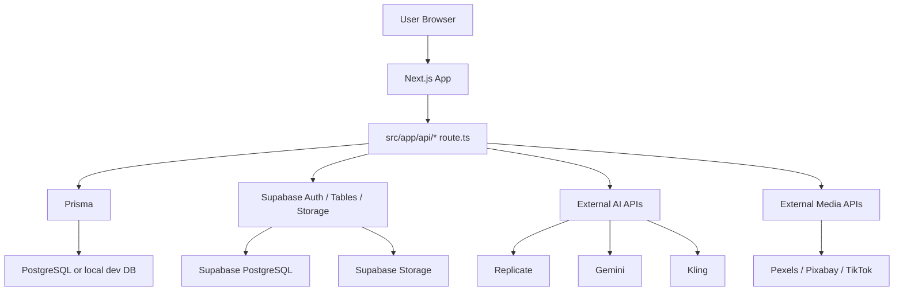
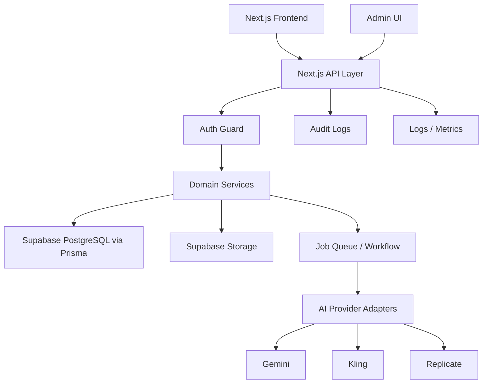

# Reels Market Backend & Admin Master Plan

작성일: 2026-05-01  
대상 프로젝트: Digital-DNA / Reels Market  
목표: 현재 백엔드가 안정적으로 동작하도록 정리하고, 운영자가 한눈에 관리할 수 있는 Admin 시스템까지 확장한다.

---

## 1. 한 줄 결론

현재 프로젝트는 Next.js 안에 API가 함께 들어있는 구조이며, Supabase, Prisma, 외부 AI API가 섞여 있다. 빌드는 성공하지만 DB 역할 분리, 인증, 작업 큐, 관리자 화면이 아직 운영 수준으로 정리되지 않았다.

우선순위는 다음과 같다.

1. DB 기준을 Supabase PostgreSQL 중심으로 통일한다.
2. 판매자/구매자/관리자 권한을 서버에서 확실히 구분한다.
3. 영상 업로드, 좋아요, 구매, 리뷰, AI 생성 작업을 안정적인 데이터 흐름으로 만든다.
4. 운영자가 볼 수 있는 Admin 페이지를 만든다.
5. AI 생성 작업과 정산/신고/콘텐츠 검수를 확장 가능한 구조로 준비한다.

---

## 2. 용어 설명

| 용어 | 쉬운 설명 |
| --- | --- |
| Backend | 사용자가 버튼을 누르면 뒤에서 처리하는 서버 기능 |
| API | 프론트 화면이 서버에 요청하는 통로 |
| DB | 영상, 유저, 결제, 리뷰 같은 데이터를 저장하는 곳 |
| Prisma | 코드에서 DB를 다루기 쉽게 해주는 도구 |
| Supabase | 로그인, DB, 파일 저장소를 제공하는 서비스 |
| Storage | 영상/이미지 파일을 저장하는 공간 |
| Auth | 로그인/회원 인증 기능 |
| RLS | Supabase에서 "자기 데이터만 볼 수 있게" 막는 보안 규칙 |
| Cron | 매일/매시간 자동 실행되는 예약 작업 |
| Queue | 오래 걸리는 일을 줄 세워 처리하는 작업 대기열 |
| Admin | 운영자가 회원, 영상, 신고, 매출, 시스템 상태를 관리하는 화면 |

---

## 3. 현재 백엔드 구조 요약



현재 핵심 파일:

| 영역 | 파일/폴더 | 역할 |
| --- | --- | --- |
| API | `src/app/api` | 모든 백엔드 엔드포인트 |
| DB 모델 | `prisma/schema.prisma` | Video, Notification, Review 등 |
| Prisma 연결 | `src/lib/prisma.ts` | DB 연결 생성 |
| Supabase 브라우저 | `src/lib/supabaseClient.ts` | 프론트 로그인 세션 |
| Supabase 서버 권한 | `src/lib/supabaseServiceRole.ts` | 서버 전용 강한 권한 |
| 영상 업로드 | `src/app/api/sell/upload/route.ts` | 판매자 영상 등록 |
| AI 생성 | `src/app/api/reels/generate/route.ts` | 생성 작업 시작/조회 |
| AI 작업 상태 | `src/lib/reelsGenerate/jobStore.ts` | 현재는 메모리 저장 |
| Cron | `src/app/api/cron/scan-stale/route.ts` | 오래된 판매글 가격 제안 |

---

## 4. 현재 기능 지도

| 기능 | 현재 상태 | 안정성 판단 |
| --- | --- | --- |
| 회원가입/로그인 | Supabase Auth 기반 | 중간 |
| Google OAuth | Supabase OAuth 콜백 존재 | 중간 |
| SMS 인증 | Twilio Verify 사용 | 중간 |
| 영상 탐색 | 정적 데이터 + DB 혼합 | 중간 |
| 판매자 영상 업로드 | Supabase Storage + Prisma Video 저장 | 중요 기능, 보강 필요 |
| 판매자 영상 수정/삭제 | API 존재 | 인증 강화 필요 |
| 좋아요/위시리스트 | Supabase favorites 테이블 | 중간 |
| 장바구니/최근 본 영상 | Supabase 테이블/블롭 혼합 | 정리 필요 |
| 리뷰 | Prisma raw SQL 사용 | 구매 검증 미흡 |
| 알림 | Prisma Notification | 인증 강화 필요 |
| AI 영상 생성 | API는 있으나 일부 mock/placeholder | 운영 불가, 확장 필요 |
| Admin | 별도 페이지 없음 | 신규 구축 필요 |

---

## 5. 핵심 문제 진단

### 5.1 DB 기준이 흔들림

`prisma/schema.prisma`는 PostgreSQL 기준인데, `src/lib/prisma.ts`는 로컬 SQLite 파일을 fallback으로 사용하려는 로직이 있다.

문제:

- 로컬과 운영 DB 문법이 달라질 수 있다.
- raw SQL이 PostgreSQL/SQLite 조건 분기 때문에 복잡해진다.
- 마이그레이션 기준이 불명확해진다.

방향:

- 운영/개발 모두 Supabase PostgreSQL 기준으로 맞춘다.
- 로컬도 Supabase 개발 프로젝트 또는 Docker PostgreSQL을 사용한다.
- SQLite fallback은 제거하거나 "완전한 데모 모드"로만 분리한다.

### 5.2 인증 방식이 API마다 다름

일부 API는 Supabase 토큰을 확인하고, 일부는 `sellerId`를 body/query로 받는다.

문제:

- 사용자가 다른 sellerId를 넣어 타인의 데이터에 접근할 위험이 있다.
- 관리자/판매자/구매자 권한 구분이 없다.

방향:

- 서버 공통 함수 `requireUser()`를 만든다.
- 서버 공통 함수 `requireAdmin()`을 만든다.
- 판매자 데이터는 항상 로그인 유저 ID와 DB의 sellerId를 비교한다.

### 5.3 AI 생성 작업 상태가 메모리에 있음

현재 `jobStore.ts`는 `Map`을 사용한다.

문제:

- 서버가 재시작되면 작업 상태가 사라진다.
- Vercel 같은 서버리스 환경에서는 요청마다 메모리가 유지된다는 보장이 없다.
- 긴 작업이 중간에 끊길 수 있다.

방향:

- `generation_jobs` 테이블을 만든다.
- 나중에 Redis/Queue/Vercel Workflow로 확장 가능하게 설계한다.

### 5.4 Admin 부재

운영자가 확인할 수 있는 화면이 없다.

문제:

- 영상 승인/삭제/수정 이력을 확인하기 어렵다.
- 유저, 판매자, 신고, AI 실패, 매출, 업로드 오류를 한눈에 볼 수 없다.
- 장애 대응이 느려진다.

방향:

- `/admin` 라우트를 만든다.
- 처음에는 읽기 위주 대시보드로 시작한다.
- 이후 승인/차단/환불/정산/공지 작성 등 액션을 단계별로 추가한다.

---

## 6. 목표 아키텍처



목표 원칙:

- API는 얇게 유지한다. 실제 로직은 `src/server` 또는 `src/lib/server`로 분리한다.
- DB는 Supabase PostgreSQL을 기준으로 한다.
- 파일은 Supabase Storage에 저장한다.
- 모든 중요한 변경은 Audit Log에 기록한다.
- Admin 액션은 반드시 관리자 권한을 확인한다.
- 긴 AI 작업은 요청-응답 API 안에서 끝내지 않는다.

---

## 7. 권한 설계

| 역할 | 설명 | 가능 작업 |
| --- | --- | --- |
| Guest | 비로그인 사용자 | 영상 탐색, 검색, 일부 미리보기 |
| Buyer | 로그인 구매자 | 좋아요, 위시리스트, 구매, 리뷰 작성 |
| Seller | 판매자 | 영상 업로드, 내 영상 수정/삭제, 판매 분석 확인 |
| Admin | 운영자 | 전체 데이터 조회, 영상 검수, 유저 제재, 공지 관리 |
| Super Admin | 최고 관리자 | 관리자 권한 부여, 시스템 설정, 위험 액션 |

권한 체크 원칙:

1. 프론트에서 버튼을 숨기는 것은 UX일 뿐이다.
2. 진짜 보안은 API 서버에서 체크해야 한다.
3. Admin API는 `requireAdmin()` 없이는 절대 실행되지 않아야 한다.
4. 삭제/차단/환불 같은 위험 액션은 Audit Log를 남긴다.

---

## 8. 데이터 모델 확장안

현재 Prisma 모델 외에 다음 테이블을 추가하는 것을 추천한다.

### 8.1 users_profile

Supabase `auth.users`와 연결되는 서비스 프로필.

| 필드 | 설명 |
| --- | --- |
| user_id | Supabase user id |
| role | buyer/seller/admin |
| nickname | 표시 이름 |
| phone | 인증된 전화번호 |
| status | active/suspended/deleted |
| created_at | 생성일 |
| updated_at | 수정일 |

### 8.2 videos

현재 모델 유지하되 상태값을 강화한다.

추가 추천 필드:

| 필드 | 설명 |
| --- | --- |
| status | draft/pending/approved/rejected/hidden |
| moderation_reason | 반려/숨김 사유 |
| source_type | upload/url/ai |
| storage_path | Storage 내부 경로 |
| thumbnail_path | 썸네일 내부 경로 |
| approved_at | 승인일 |
| approved_by | 승인 관리자 |

### 8.3 purchases

구매 기록. 현재 리뷰 작성 제한이 약하므로 필요하다.

| 필드 | 설명 |
| --- | --- |
| id | 구매 ID |
| buyer_id | 구매자 |
| video_id | 영상 |
| seller_id | 판매자 |
| price | 구매 당시 가격 |
| status | paid/refunded/canceled |
| created_at | 구매일 |

### 8.4 generation_jobs

AI 생성 작업 상태 저장.

| 필드 | 설명 |
| --- | --- |
| id | 작업 ID |
| user_id | 요청자 |
| source_video_id | 원본 영상 |
| status | queued/running/succeeded/failed/canceled |
| stage | 현재 단계 |
| progress | 진행률 |
| input_json | 요청 데이터 |
| output_url | 결과 영상 URL |
| provider_json | 외부 API 작업 ID |
| error_message | 실패 사유 |

### 8.5 admin_audit_logs

관리자 액션 기록.

| 필드 | 설명 |
| --- | --- |
| id | 로그 ID |
| actor_id | 실행한 관리자 |
| action | 실행 액션 |
| target_type | video/user/order 등 |
| target_id | 대상 ID |
| before_json | 변경 전 |
| after_json | 변경 후 |
| created_at | 실행 시간 |

### 8.6 reports

신고/검수 기능.

| 필드 | 설명 |
| --- | --- |
| id | 신고 ID |
| reporter_id | 신고자 |
| target_type | video/review/user |
| target_id | 대상 |
| reason | 신고 사유 |
| status | open/reviewing/resolved/rejected |
| assigned_admin_id | 담당자 |

---

## 9. Admin 페이지 기획

Admin URL:

- `/admin`
- `/admin/videos`
- `/admin/users`
- `/admin/sellers`
- `/admin/orders`
- `/admin/generation-jobs`
- `/admin/reports`
- `/admin/notices`
- `/admin/settings`

### 9.1 Admin 메인 대시보드

목표: 운영자가 10초 안에 서비스 상태를 파악한다.

구성:

| 영역 | 보여줄 내용 |
| --- | --- |
| KPI 카드 | 오늘 가입자, 오늘 업로드, 오늘 판매, AI 실패율 |
| 시스템 상태 | DB 연결, Supabase Storage, AI Provider 상태 |
| 검수 큐 | 승인 대기 영상, 신고 접수, 실패한 업로드 |
| 매출 요약 | 오늘 매출, 7일 매출, 판매자 정산 예정액 |
| 최근 이벤트 | 관리자 액션, 오류 로그, AI 작업 실패 |

시각 구조:

```text
+----------------------------------------------------+
| Admin Header: Reels Market Operations              |
+-------------------+----------------+---------------+
| Today Revenue     | Pending Videos | AI Failure     |
| New Users         | Reports        | Upload Errors  |
+----------------------------------------------------+
| Moderation Queue                                  |
+----------------------------------------------------+
| Revenue Chart       | AI Job Health                |
+----------------------------------------------------+
| Recent Admin Actions / System Logs                 |
+----------------------------------------------------+
```

### 9.2 영상 관리

필요 기능:

- 영상 목록 검색
- 상태 필터: pending/approved/rejected/hidden
- 판매자별 필터
- 카테고리 필터
- 가격/조회/판매 정렬
- 썸네일 미리보기
- 승인/반려/숨김 처리
- 반려 사유 입력
- 원본 파일/썸네일 Storage 경로 확인

초기 버전에서는 읽기 + 상태 변경까지만 구현한다.

### 9.3 유저 관리

필요 기능:

- 유저 목록
- 이메일/닉네임/전화번호 검색
- 역할 변경: buyer/seller/admin
- 계정 상태 변경: active/suspended
- 가입일/최근 로그인/구매 수/업로드 수

주의:

- 관리자 권한 부여는 Super Admin만 가능하게 한다.

### 9.4 판매자 관리

필요 기능:

- 판매자 프로필
- 등록 영상 수
- 총 판매액
- 반려/신고 이력
- 정산 정보 준비 상태
- 판매자 등급 또는 신뢰도

### 9.5 주문/구매 관리

필요 기능:

- 구매 내역
- 결제 상태
- 환불 상태
- 구매자/판매자/영상 연결
- 리뷰 작성 여부

초기에는 실제 결제 연동이 없으면 mock/demo 구매와 실제 구매 테이블을 분리해서 관리한다.

### 9.6 AI 작업 관리

필요 기능:

- 작업 ID 검색
- 요청자
- 원본 영상
- 현재 단계
- 진행률
- 실패 사유
- 재시도 버튼
- 결과물 URL
- Provider별 작업 ID

운영에서 가장 중요한 화면 중 하나다. AI 생성은 실패가 잦을 수 있으므로 실패를 추적할 수 있어야 한다.

### 9.7 신고/검수 관리

필요 기능:

- 신고 목록
- 대상 영상/리뷰/유저
- 신고 사유
- 상태 변경
- 관리자 메모
- 처리 이력

### 9.8 공지 관리

현재 `/api/notices`가 있으므로 Admin에서 공지를 작성/수정/숨김 처리할 수 있게 한다.

필요 기능:

- 공지 작성
- 공지 상태: draft/published/hidden
- 고정 공지
- 예약 게시

---

## 10. API 재설계 원칙

### 10.1 API 이름 규칙

추천:

| 목적 | URL |
| --- | --- |
| 공개 영상 목록 | `GET /api/videos` |
| 영상 상세 | `GET /api/videos/:id` |
| 판매자 내 영상 | `GET /api/seller/videos` |
| 판매자 업로드 | `POST /api/seller/videos` |
| 판매자 수정 | `PATCH /api/seller/videos/:id` |
| 판매자 삭제 | `DELETE /api/seller/videos/:id` |
| Admin 영상 목록 | `GET /api/admin/videos` |
| Admin 영상 승인 | `POST /api/admin/videos/:id/approve` |
| AI 작업 생성 | `POST /api/generation/jobs` |
| AI 작업 조회 | `GET /api/generation/jobs/:id` |

현재 API를 한 번에 바꾸면 위험하므로, 기존 API는 유지하면서 새 API를 점진적으로 추가한다.

### 10.2 공통 응답 형식

성공:

```json
{
  "ok": true,
  "data": {}
}
```

실패:

```json
{
  "ok": false,
  "error": {
    "code": "login_required",
    "message": "로그인이 필요합니다."
  }
}
```

장점:

- 프론트에서 에러 처리 방식이 단순해진다.
- Admin에서도 같은 API 패턴을 재사용할 수 있다.

---

## 11. 보안 체크리스트

| 항목 | 필요 여부 | 우선순위 |
| --- | --- | --- |
| 모든 판매자 API에서 로그인 유저 확인 | 필수 | 높음 |
| Admin API에서 관리자 권한 확인 | 필수 | 높음 |
| Service Role Key 클라이언트 노출 방지 | 필수 | 높음 |
| 업로드 파일 타입/크기 제한 | 필수 | 높음 |
| 영상 소유권 확인 | 필수 | 높음 |
| 리뷰 작성 전 구매 여부 확인 | 필수 | 중간 |
| 관리자 액션 Audit Log | 필수 | 중간 |
| Rate Limit | 필요 | 중간 |
| 신고/차단 이력 | 필요 | 중간 |
| 개인정보 접근 로그 | 필요 | 중간 |

---

## 12. 개발 단계 제안

### Phase 0. 현 상태 고정

목표: 지금 되는 것을 깨지 않기.

작업:

- 현재 빌드 상태 기록
- 환경변수 목록 문서화
- API 목록 문서화
- DB 테이블 목록 문서화
- Supabase SQL 적용 여부 체크리스트 작성

완료 기준:

- `npm run build` 성공
- 로컬 접속 가능
- 필수 환경변수 목록 정리

### Phase 1. DB 기준 정리

목표: 데이터 저장 기준을 하나로 맞춘다.

작업:

- Supabase PostgreSQL을 기준 DB로 확정
- Prisma schema와 실제 Supabase 테이블 비교
- SQLite fallback 제거 여부 결정
- 마이그레이션 전략 수립
- `Video`, `Notification`, `Review` 테이블 운영 스키마 정리

완료 기준:

- 로컬/운영 DB 연결 방식이 문서화됨
- Prisma Client가 동일 DB 기준으로 동작

### Phase 2. 인증/권한 공통화

목표: API마다 다른 인증 방식을 하나로 묶는다.

작업:

- `requireUser()` 구현
- `requireAdmin()` 구현
- `requireSellerOwner(videoId)` 구현
- 판매자 업로드/수정/삭제 API에 적용
- 알림 수락 API에 적용

완료 기준:

- 타인의 `sellerId`를 넣어도 접근 불가
- 관리자 권한 없는 유저는 Admin API 접근 불가

### Phase 3. Admin MVP

목표: 운영자가 현재 상태를 볼 수 있게 한다.

초기 화면:

- `/admin`
- `/admin/videos`
- `/admin/users`
- `/admin/generation-jobs`

초기 기능:

- 대시보드 KPI
- 영상 목록
- 유저 목록
- AI 작업 목록
- 읽기 전용 위주

완료 기준:

- 관리자만 접근 가능
- 운영 데이터가 테이블로 표시됨
- 모바일보다 데스크톱 운영 화면에 최적화

### Phase 4. 영상 검수/관리

목표: 업로드 콘텐츠를 운영자가 승인/반려할 수 있게 한다.

작업:

- Video `status` 필드 추가
- 업로드 직후 `pending`
- Admin 승인 시 `approved`
- 반려 사유 저장
- 공개 목록은 `approved`만 노출

완료 기준:

- 승인 전 영상이 공개 피드에 나오지 않음
- Admin에서 승인/반려 가능

### Phase 5. AI 작업 안정화

목표: AI 생성 작업이 재시작에도 안전하게 남도록 한다.

작업:

- `generation_jobs` 테이블 추가
- `jobStore.ts`를 DB 기반으로 교체
- 작업 단계별 로그 저장
- 실패 재시도 설계
- Provider Adapter 구조 정리

완료 기준:

- 새로고침해도 작업 상태 유지
- 서버 재시작 후에도 작업 조회 가능

### Phase 6. 구매/리뷰/정산 기반

목표: 마켓플레이스 핵심 거래 흐름을 완성한다.

작업:

- `purchases` 테이블 추가
- 구매자만 리뷰 가능
- 판매량/매출 집계 기준 통일
- 판매자 분석 DB 기반화
- 정산 준비 데이터 생성

완료 기준:

- 구매 기록과 리뷰 권한이 연결됨
- 판매자 대시보드 숫자가 DB 기준으로 계산됨

---

## 13. Admin UI 디자인 방향

Admin은 화려한 랜딩 페이지가 아니라 운영 도구다.

디자인 원칙:

- 정보 밀도는 높게, 시각은 차분하게
- 카드 남발 금지
- 표, 필터, 탭, 상태 배지 중심
- 위험 액션은 확인 모달 사용
- 모든 변경 액션은 성공/실패 피드백 표시

추천 레이아웃:

```text
좌측 사이드바
  Dashboard
  Videos
  Users
  Sellers
  Orders
  AI Jobs
  Reports
  Notices
  Settings

상단바
  검색 / 현재 관리자 / 환경 표시

본문
  필터 바
  데이터 테이블
  오른쪽 상세 패널 또는 모달
```

상태 색상:

| 상태 | 색상 방향 |
| --- | --- |
| approved/succeeded/active | green |
| pending/running | amber |
| rejected/failed/suspended | red |
| draft/hidden | gray |

---

## 14. 운영자가 꼭 봐야 하는 지표

| 지표 | 이유 |
| --- | --- |
| 오늘 가입자 | 성장 확인 |
| 오늘 업로드 수 | 공급 증가 확인 |
| 승인 대기 영상 수 | 운영 병목 확인 |
| AI 생성 성공률 | 핵심 기능 품질 |
| AI 평균 처리 시간 | 사용자 경험 |
| 업로드 실패율 | 판매자 이탈 방지 |
| 오늘 구매 수 | 매출 확인 |
| 신고 접수 수 | 콘텐츠 리스크 |
| Storage 사용량 | 비용 관리 |
| API 에러 수 | 장애 감지 |

---

## 15. 환경변수 정리 기준

필수:

- `DATABASE_URL`
- `DIRECT_URL`
- `NEXT_PUBLIC_SUPABASE_URL`
- `NEXT_PUBLIC_SUPABASE_ANON_KEY`
- `SUPABASE_SERVICE_ROLE_KEY`
- `CRON_SECRET`

선택:

- `TWILIO_ACCOUNT_SID`
- `TWILIO_AUTH_TOKEN`
- `TWILIO_VERIFY_SERVICE_SID`
- `GEMINI_API_KEY`
- `REPLICATE_API_TOKEN`
- `KLING_ACCESS_KEY`
- `KLING_SECRET_KEY`
- `NEXT_PUBLIC_PEXELS_API_KEY`
- `NEXT_PUBLIC_PIXABAY_API_KEY`
- `TIKTOK_CLIENT_KEY`
- `TIKTOK_CLIENT_SECRET`

주의:

- `NEXT_PUBLIC_`이 붙은 값은 브라우저에 노출될 수 있다.
- 비밀키는 절대 `NEXT_PUBLIC_`을 붙이지 않는다.
- `SUPABASE_SERVICE_ROLE_KEY`는 서버에서만 사용한다.

---

## 16. 첫 개발 작업 추천

가장 먼저 할 작업:

1. `/docs/API_INVENTORY.md` 작성
2. `/docs/DATABASE_INVENTORY.md` 작성
3. `requireUser()` 공통 함수 작성
4. `requireAdmin()` 공통 함수 작성
5. `/admin` 기본 레이아웃 생성
6. Admin Dashboard 읽기 전용 KPI 연결

왜 이 순서인가:

- 현재 구조를 깨지 않고 시작할 수 있다.
- 관리자 화면을 빨리 볼 수 있다.
- 이후 위험한 수정 전에 권한 체계를 먼저 세울 수 있다.
- 판매자/영상/AI 기능을 안정적으로 확장할 기반이 된다.

---

## 17. 개발 전 확인 질문

이 문서를 기준으로 실제 개발을 시작하기 전에 아래 결정을 하면 좋다.

1. 운영 DB는 Supabase PostgreSQL 하나로 확정할 것인가?
2. Admin 계정은 특정 이메일 목록으로 시작할 것인가, DB role로 관리할 것인가?
3. 영상은 업로드 즉시 공개할 것인가, 관리자 승인 후 공개할 것인가?
4. 구매/결제는 지금 바로 실제 결제로 갈 것인가, 먼저 demo purchase 테이블로 흐름을 만들 것인가?
5. AI 생성은 당장 외부 API 실연동까지 갈 것인가, 먼저 작업 상태/관리 화면을 완성할 것인가?

추천 답:

- DB는 Supabase PostgreSQL로 통일
- Admin은 초기에는 이메일 allowlist, 이후 DB role
- 영상은 승인 후 공개
- 구매는 demo purchase 테이블부터 정리
- AI는 작업 상태/관리 화면부터 완성 후 외부 API 안정화

---

## 18. 다음 실행 계획

바로 다음 개발 순서:

1. API/DB 인벤토리 문서 생성
2. Admin 접근 정책 결정
3. Admin 레이아웃과 대시보드 MVP 생성
4. 공통 인증 함수 추가
5. 판매자 영상 API 보안 강화
6. AI 작업 상태 DB화 설계 및 1차 구현

이 순서대로 가면 눈에 보이는 Admin 화면을 빨리 만들면서도, 뒤쪽 백엔드가 무너지지 않게 기본기를 같이 세울 수 있다.
