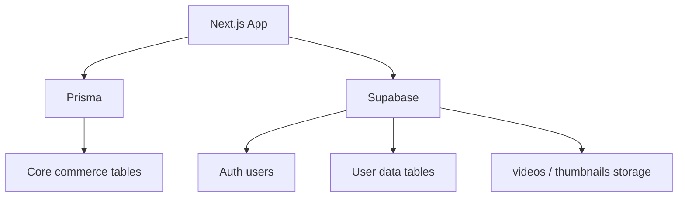

# Database Inventory

작성일: 2026-05-01

이 문서는 현재 데이터가 어디에 저장되는지 정리한 운영용 지도입니다.

## 2026-05-01 결정 및 진행 상태

| 항목 | 상태 |
| --- | --- |
| 기준 DB | Supabase PostgreSQL로 확정 |
| SQLite fallback | 코드에서 제거 완료 |
| Admin 이메일 | `youngho940701@gmail.com` 설정 완료 |
| 신규 Prisma 모델 | `Purchase`, `GenerationJob`, `AdminAuditLog`, `Report` 추가 완료 |
| Supabase SQL 파일 | `supabase/core_backend_tables.sql` 작성 완료 |
| 실제 Supabase DB 반영 | 아직 실행 전. 적용 직전 사용자 확인 필요 |

## 현재 저장소 구분

## Prisma 모델

파일: `prisma/schema.prisma`

| 모델 | 실제 테이블 | 역할 | 운영 판단 |
| --- | --- | --- | --- |
| `Video` | `videos` | 판매 영상/마켓 영상 | 핵심 테이블 |
| `Notification` | `notifications` | 판매자 가격 제안 알림 | 인증 보강 필요 |
| `VideoReview` | `video_reviews` | 영상 리뷰 | 구매 검증 필요 |
| `NicknameReservation` | `nickname_reservations` | 닉네임 중복 방지 | 유지 |
| `TikTokAuthSession` | `tiktok_auth_sessions` | TikTok 토큰 세션 | 보안 검토 필요 |

## Supabase SQL 파일

| 파일 | 역할 |
| --- | --- |
| `supabase/profiles.sql` | 유저 프로필 테이블 |
| `supabase/favorites.sql` | 좋아요/위시리스트 |
| `supabase/user_sync.sql` | Supabase Auth와 프로필 동기화 |
| `supabase/profiles_extend_and_seller_draft.sql` | 프로필 확장, 판매자 임시저장 |
| `supabase/storage_videos_thumbnails_sell.sql` | 영상/썸네일 Storage 정책 |

## Supabase 테이블 이름

파일: `src/lib/supabaseTableNames.ts`

| 코드 이름 | 기본 테이블 | 역할 |
| --- | --- | --- |
| `cart` | `user_cart_items` | 장바구니 |
| `favorites` | `favorites` | 좋아요/위시리스트 |
| `profiles` | `profiles` | 프로필 |
| `recentViews` | `user_recent_views` | 최근 본 영상 |
| `demoPurchases` | `user_demo_purchases` | 데모 구매 |
| `customizeDrafts` | `user_customize_drafts` | 커스터마이징 임시저장 |
| `dataBlobs` | `user_data_blobs` | 기타 JSON 데이터 |
| `sellerUploadDrafts` | `seller_upload_drafts` | 판매자 업로드 임시저장 |

## 현재 가장 큰 DB 리스크

1. Prisma schema는 PostgreSQL 기준인데 로컬 fallback에 SQLite가 섞여 있다.
2. Supabase 직접 테이블과 Prisma 테이블의 책임 경계가 문서화되어 있지 않았다.
3. AI Job 상태가 DB가 아니라 메모리 `Map`에 있다.
4. 구매 테이블이 명확하지 않아 리뷰 권한을 제대로 검증하기 어렵다.
5. Admin Audit Log 테이블이 없다.

## 추천 신규 테이블

| 테이블 | 목적 | 우선순위 |
| --- | --- | --- |
| `admin_audit_logs` | 관리자 액션 기록 | 높음 |
| `generation_jobs` | AI 생성 작업 영구 저장 | 높음 |
| `purchases` | 구매 기록 | 높음 |
| `reports` | 신고/검수 | 중간 |
| `admin_notes` | 운영자 내부 메모 | 낮음 |

## DB 정리 원칙

- 운영 기준 DB는 Supabase PostgreSQL로 통일한다.
- 파일은 DB에 넣지 않고 Supabase Storage에 저장한다.
- DB에는 파일 URL, storage path, metadata만 저장한다.
- 구매/리뷰/정산은 반드시 관계형 테이블로 남긴다.
- Admin이 바꾸는 모든 중요한 상태는 Audit Log에 남긴다.
